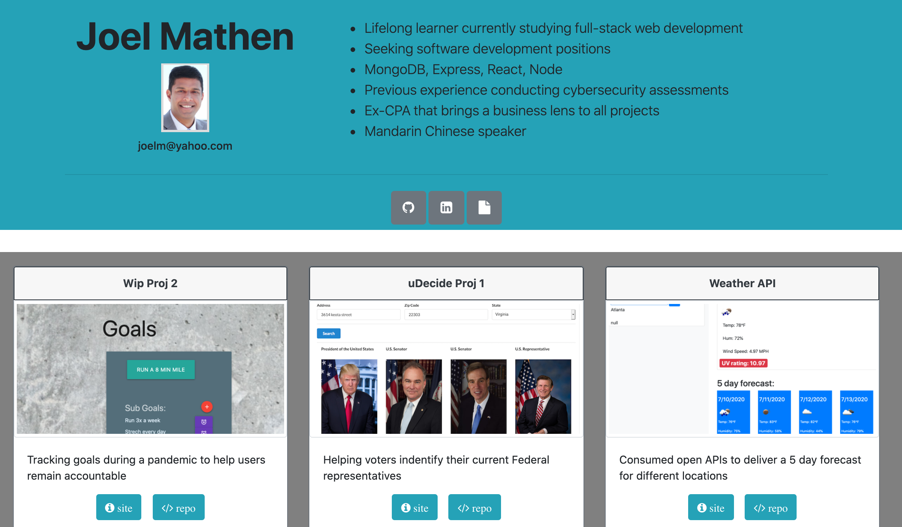

# Portfolio Hightlights
I designed a porfolio to highlight key projects that I have completed to showcase growing software developer skills

## Technologies Used
I used React and Bootstrap framework for CSS to handle the front-end design and linked contact information along with cards to showcase my GitHub repos and deployed links. I also have deployed a second page using React Router with a resume as a PDF. 

### Link to deployed Portfolio
[Portfolio](https://github.com/crackedsnowboard/react-portfolio)

#### Image of deployed web applicaton

